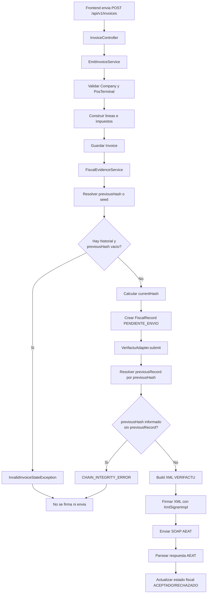
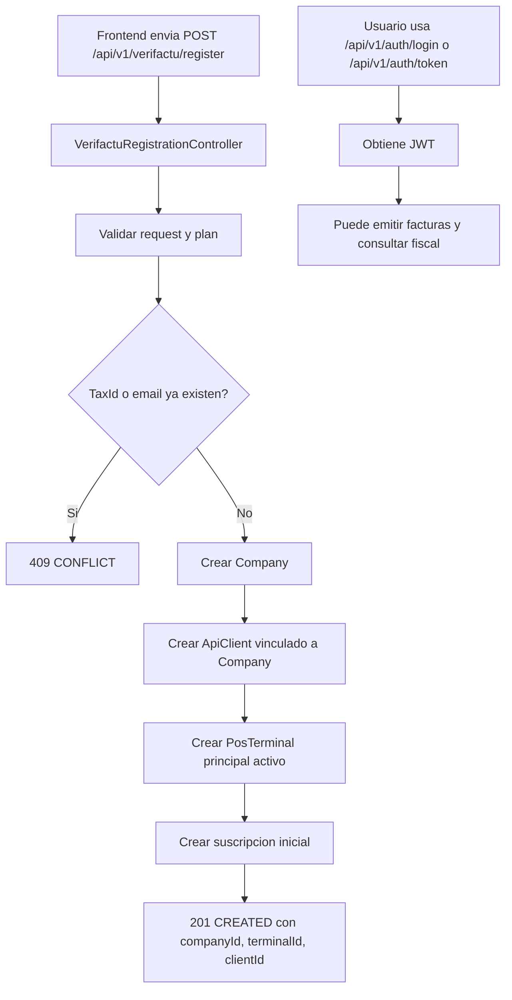

# Guía Maestra Backend NovaPay

## 1. Objetivo del backend

Este backend implementa el núcleo de negocio de NovaPay para:

- Registro y autenticación de clientes API.
- Alta y gestión de empresa fiscal.
- Alta automática de terminal TPV.
- Emisión de facturas.
- Preparación de evidencia fiscal (cadena hash).
- Firma digital XML y envío a VERIFACTU (AEAT).
- Consulta de estado fiscal y reintentos controlados.

El proyecto sigue una estructura de arquitectura hexagonal (dominio, aplicación, infraestructura).

## 2. Arquitectura y capas

### 2.1 Dominio

Contiene:

- Entidades de negocio: Invoice, FiscalRecord, Company, ApiClient, PosTerminal.
- Value objects: TaxId, InvoiceNumber, Money.
- Reglas de negocio puras.
- Puertos de entrada/salida (interfaces).

### 2.2 Aplicación

Contiene casos de uso y orquestación:

- Emisión de factura.
- Preparación de evidencia fiscal.
- Reintento fiscal.
- Autenticación y registro.

Servicios principales:

- EmitInvoiceService
- FiscalEvidenceService
- RetryFiscalSubmissionService
- AuthenticationService

### 2.3 Infraestructura

Implementa detalles técnicos:

- REST controllers.
- Persistencia JPA y repositorios.
- Integración VERIFACTU.
- Firma XMLDSig (Santuario).
- Seguridad JWT.
- Manejo de errores HTTP.

## 3. Seguridad y autenticación

### 3.1 Seguridad JWT

La configuración principal está en SecurityConfig:

- API stateless.
- JWT filter para endpoints protegidos.
- Endpoints públicos para login/registro y verificación.

Endpoints públicos más relevantes:

- POST /api/v1/auth/token
- POST /api/v1/auth/registro
- POST /api/v1/auth/login
- POST /api/v1/auth/verify-email
- POST /api/v1/auth/forgot-password
- GET /actuator/health
- Swagger

### 3.2 Flujos de autenticación

Se soportan dos modelos:

- Legacy: clientId/clientSecret en /auth/token.
- Nuevo: email/password con verificación de email.

Flujo nuevo:

1. Registro en /api/v1/auth/registro.
2. Se crea cliente con emailVerified=false.
3. Se envía token de verificación por email.
4. Verificación en /api/v1/auth/verify-email.
5. Login en /api/v1/auth/login.

Nota: actualmente el login nuevo devuelve un placeholder de token en AuthenticationService. Si se requiere producción inmediata de ese flujo, conviene integrar JwtTokenProvider directamente ahí.

## 4. Configuración principal

Archivo base:

- src/main/resources/application.yml

Variables importantes:

- DB_HOST, DB_PORT, DB_NAME, DB_USER, DB_PASSWORD
- JWT_SECRET, JWT_EXPIRATION_MIN
- CERT_SIGNING_ENABLED
- CERT_P12_BASE64 o CERT_P12_BASE64_FILE
- CERT_PASSWORD
- CERT_ALIAS
- VERIFACTU_ENDPOINT_URL
- VERIFACTU_SOAP_ACTION
- VERIFACTU_TIMEOUT
- VERIFACTU_MAX_RETRIES
- VERIFACTU_PRODUCTION
- FISCAL_CHAIN_SEED_HASH (opcional)

## 5. Módulo VERIFACTU y firma digital

### 5.1 Componentes

- VerifactuAdapter
- VerifactuXmlBuilder
- VerifactuSoapClient
- VerifactuResponseParser
- XmlSignerImpl

### 5.2 Firma XML

XmlSignerImpl:

- Firma XML con RSA-SHA256 (XMLDSig).
- Carga certificado PKCS12 desde base64.
- Puede leer por variable directa o por archivo (CERT_P12_BASE64_FILE).

#### Generación del certificado en base64 desde terminal/bash

Para preparar el certificado PKCS12 (.p12) en formato base64 y subirlo al servidor:

**1. Convertir el certificado .p12 a base64:**

```bash
# Desde bash/terminal en tu máquina local
cat certificado.p12 | base64 > cert_base64.txt

# Verificar que el archivo se generó correctamente
cat cert_base64.txt
```

**2. Si tienes el certificado en otro formato (PEM o CER), convertir primero a PKCS12:**

```bash
# De PEM a PKCS12
openssl pkcs12 -export -in certificado.pem -inkey clave_privada.key -out certificado.p12 -name "tu_alias"

# Luego convertir el .p12 a base64
cat certificado.p12 | base64 > cert_base64.txt
```

**3. Validar el contenido del certificado (sin exponer en repositorio):**

```bash
# Listar alias disponibles en el .p12
keytool -list -v -keystore certificado.p12 -storetype PKCS12

# Verificar que coincide con CERT_ALIAS en .env
```

#### Subida y configuración en el servidor

**En deploy/secrets/:**

```bash
# Copiar el archivo generado a la carpeta de secrets del servidor
cp cert_base64.txt deploy/secrets/cert_base64.txt

# NO guardar en repositorio: agregar a .gitignore
echo "deploy/secrets/cert_base64.txt" >> .gitignore
```

**Configuración en .env del servidor:**

```bash
# En deploy/.env.server (o tu archivo .env de producción)

# Opción 1: Usar archivo montado en volumen (RECOMENDADO EN PRODUCCIÓN)
CERT_P12_BASE64_FILE=/run/secrets/cert_base64.txt

# Opción 2: Usar variable directa (solo si el base64 cabe y es seguro)
CERT_P12_BASE64=$(cat deploy/secrets/cert_base64.txt)

# Contraseña del certificado
CERT_PASSWORD=tu_contraseña_p12

# Alias del certificado (debe coincidir con el del .p12)
CERT_ALIAS=tu_alias

# Habilitar firma
CERT_SIGNING_ENABLED=true
```

**En docker-compose.server.yml:**

```yaml
services:
  backend:
    environment:
      CERT_P12_BASE64_FILE: /run/secrets/cert_base64_content
    secrets:
      - cert_base64_content

secrets:
  cert_base64_content:
    file: ./secrets/cert_base64.txt
```

Recomendación de operación:

- En servidor, usar `CERT_P12_BASE64_FILE` montado en volumen de solo lectura (método más seguro).
- Evitar guardar el .p12 o base64 en repositorio.
- El archivo `deploy/secrets/cert_base64.txt` debe estar protegido (permisos 600).
- En desarrollo local, puede usarse CERT_P12_BASE64 directa si es necesario para testing.

## 6. Flujo maestro: creación de factura firmada

Este es el flujo de extremo a extremo que ejecuta el backend.

### 6.1 Entrada

Endpoint:

- POST /api/v1/invoices

El controller transforma DTO a comando y delega en EmitInvoiceService.

### 6.2 Resolución de contexto de negocio

EmitInvoiceService:

1. Carga Company por companyId.
2. Carga PosTerminal por terminalId.
3. Construye líneas de factura y calcula impuestos.
4. Persiste Invoice.

### 6.3 Evidencia fiscal y cadena hash

FiscalEvidenceService:

1. Busca historial fiscal reciente de la empresa.
2. Obtiene previousHash válido (último currentHash no vacío).
3. Si no encuentra, intenta seed por cliente o variable global.
4. Calcula currentHash encadenado.
5. Crea FiscalRecord en PENDIENTE_ENVIO.

### 6.4 Protección de integridad de cadena (implementado)

Regla actual:

- Si no hay previousHash y sí existe historial previo de registros, se bloquea el proceso con InvalidInvoiceStateException.

Esto evita firmar como primer registro cuando la cadena real ya existe.

### 6.5 Construcción XML, firma y envío

VerifactuAdapter:

1. Resuelve registro anterior por previousHash.
2. Construye XML con VerifactuXmlBuilder.
3. Firma XML con XmlSignerImpl.
4. Envía SOAP a AEAT.
5. Parsea respuesta y actualiza estado fiscal.

### 6.6 Protección extra en envío (implementado)

Regla actual:

- Si FiscalRecord trae previousHash pero no existe el registro anterior enlazado, se lanza error CHAIN_INTEGRITY_ERROR y no se envía.

### 6.7 Persistencia de resultado

Tras envío:

- Estado: ACEPTADO o RECHAZADO.
- Guardado de XML enviado y respuesta XML.
- Timestamps de envío y respuesta.

Si hay excepción de firma/envío en emisión:

- Se marca ERROR_PERMANENTE.
- Se persiste detalle en responseXml.

## 7. Encadenamiento inicial correcto

Definición operativa:

1. Primer registro:
   - No hay huella anterior.
   - Se genera huella con los datos del propio registro.
2. Segundo registro:
   - Debe incluir huella del primero.
3. Tercero y siguientes:
   - Cada uno incluye la huella del anterior.

Regla clave:

- Si existe historial y falta huella previa, no se firma ni se envía hasta subsanar.

## 8. Reintentos fiscales

Endpoint:

- POST /api/v1/fiscal/retry/{invoiceId}

RetryFiscalSubmissionService:

1. Verifica que exista factura y registro fiscal.
2. Si ya está ACEPTADO, no reintenta.
3. Intenta reconstruir previousHash desde último ACEPTADO de la empresa.
4. Limpia restos técnicos del intento anterior.
5. Incrementa retryCount y cambia estado a REINTENTO.
6. Reenvía por fiscalAgencyPort.

Protección actual:

- Si no hay previousHash y existe historial anterior, lanza InvalidInvoiceStateException y no permite reintento fuera de cadena.

## 9. Registro de usuarios, empresa y terminales

### 9.1 Registro general de usuario

Endpoint:

- POST /api/v1/auth/registro

Crea ApiClient con email y password cifrada.

### 9.2 Registro Verifactu completo (empresa + terminal + suscripción)

Endpoint:

- POST /api/v1/verifactu/register

Este endpoint:

1. Valida plan, ciclo y contraseña robusta.
2. Crea Company.
3. Crea ApiClient vinculado a la Company.
4. Crea PosTerminal principal automáticamente.
5. Crea suscripción de facturación.

También ofrece:

- GET /api/v1/verifactu/company/{clientId}
- GET /api/v1/verifactu/subscription/{clientId}

## 10. Endpoints funcionales principales

### 10.1 Auth

- POST /api/v1/auth/token
- POST /api/v1/auth/registro
- POST /api/v1/auth/login
- POST /api/v1/auth/verify-email
- POST /api/v1/auth/forgot-password
- POST /api/v1/auth/change-password

### 10.2 Facturas

- POST /api/v1/invoices
- GET /api/v1/invoices/{id}
- POST /api/v1/invoices/{id}/cancel

### 10.3 Fiscal

- GET /api/v1/fiscal/status/{invoiceId}
- GET /api/v1/fiscal/interactions
- POST /api/v1/fiscal/retry/{invoiceId}

### 10.4 Verifactu onboarding

- POST /api/v1/verifactu/register
- GET /api/v1/verifactu/company/{clientId}
- GET /api/v1/verifactu/subscription/{clientId}

## 11. Estados clave de factura y fiscal

Factura:

- EMITIDA
- ANULADA (según flujo de cancelación)

FiscalRecord:

- PENDIENTE_ENVIO
- REINTENTO
- ACEPTADO
- RECHAZADO
- ERROR_PERMANENTE

## 12. Errores y manejo HTTP

GlobalExceptionHandler centraliza errores y responde ProblemDetail.

Ejemplos:

- 404: recursos no encontrados
- 409: estado inválido de negocio
- 400: validaciones
- 502: error de envío fiscal externo
- 500: error interno

## 13. Base de datos y migraciones

- PostgreSQL como base principal.
- Flyway habilitado.
- Hibernate ddl-auto: validate.

Recomendaciones:

- Mantener migraciones versionadas en src/main/resources/db/migration.
- No usar update automático en producción.

## 14. Observabilidad y trazabilidad

Se recomienda monitorear:

- Logs de VerifactuAdapter (envío, rechazo, parseo).
- Logs de XmlSignerImpl (presencia de alias y certificado, sin exponer secretos).
- Tabla de fiscal records para diagnóstico de cadena y reintentos.

Artefactos útiles en troubleshooting local:

- last_sent.xml
- last_response.xml

## 15. Despliegue en servidor

Guía operativa disponible en:

- deploy/DEPLOY_SERVER_STEP_BY_STEP.md

Artefactos de despliegue:

- Dockerfile
- deploy/docker-compose.server.yml
- deploy/nginx.conf
- deploy/.env.server.example

## 16. Checklist operativo (antes de salida a producción)

1. Certificado y alias validados con keytool.
2. CERT_SIGNING_ENABLED=true en producción.
3. Endpoint VERIFACTU correcto (pre o producción).
4. Flujo de 3 facturas consecutivas validado (encadenamiento correcto).
5. Reintento validado ante fallo controlado.
6. Control de accesos y secretos verificado.
7. Backups de PostgreSQL definidos.

## 17. Próximas mejoras sugeridas

1. Integrar JwtTokenProvider en login email/password para devolver JWT real en ese flujo.
2. Añadir CORS configurable por entorno para conexión frontend pública.
3. Añadir pruebas de integración full flow emit/retry/cadena.
4. Añadir healthchecks de dependencias (DB y endpoint fiscal).
5. Añadir rate limiting y hardening HTTP en capa reverse proxy pública.

## 18. Diagrama: flujo de emisión de factura firmada



## 19. Diagrama: registro de usuario + alta de empresa + provisión TPV



## 20. Tabla maestra de ejemplos request/response

Los ejemplos son operativos y están alineados con los DTO actuales del backend.

| Endpoint | Objetivo | Request de ejemplo | Response de ejemplo |
|---|---|---|---|
| `POST /api/v1/verifactu/register` | Alta completa (empresa + cliente + terminal + suscripción) | ```json
{
   "companyName": "Mi Comercio SL",
   "taxId": "B12345678",
   "address": "Calle Mayor 1, Madrid",
   "clientHash": "",
   "email": "admin@micomercio.es",
   "password": "NovaPay@12345",
   "passwordConfirmation": "NovaPay@12345",
   "planCode": "PLAN_5000",
   "billingCycle": "MONTHLY",
   "isNewSystem": true
}
``` | ```json
{
   "message": "Registro Verifactu completado",
   "companyId": "f8f93f6f-9147-4c86-86e6-1f20c1fe1101",
   "terminalId": "4c771f36-c6ec-43a8-a823-e2b35b7732e9",
   "clientId": "B12345678",
   "email": "admin@micomercio.es",
   "planCode": "PLAN_5000",
   "billingCycle": "MONTHLY",
   "baseAmount": "12.00",
   "invoiceLimit": "5000",
   "overagePerInvoice": "0.05"
}
``` |
| `POST /api/v1/auth/registro` | Registro por email/password con verificación | ```json
{
   "email": "user@empresa.es",
   "password": "NovaPay@12345",
   "companyId": "f8f93f6f-9147-4c86-86e6-1f20c1fe1101",
   "clientSigningPreviousHash": "ABCDEF1234567890"
}
``` | ```json
{
   "message": "Usuario registrado. Verifica tu email"
}
``` |
| `POST /api/v1/auth/login` | Login por email/password | ```json
{
   "email": "user@empresa.es",
   "password": "NovaPay@12345"
}
``` | ```json
{
   "access_token": "jwt-token-placeholder",
   "token_type": "Bearer",
   "expires_in": 3600,
   "clientId": "B12345678",
   "email": "user@empresa.es",
   "email_verified": true,
   "message": "Login exitoso"
}
``` |
| `POST /api/v1/auth/token` | Login legacy por clientId/clientSecret | ```json
{
   "clientId": "B12345678",
   "clientSecret": "tuPasswordPlano"
}
``` | ```json
{
   "access_token": "eyJhbGciOiJIUzI1NiIs...",
   "token_type": "Bearer",
   "expires_in": 3600,
   "clientId": null,
   "email": null,
   "email_verified": false,
   "message": null
}
``` |
| `POST /api/v1/invoices` | Emitir factura y disparar firma/envío fiscal | ```json
{
   "series": "TPV",
   "number": 1001,
   "type": "COMPLETA",
   "companyId": "f8f93f6f-9147-4c86-86e6-1f20c1fe1101",
   "terminalId": "4c771f36-c6ec-43a8-a823-e2b35b7732e9",
   "issueDate": "2026-04-05",
   "lines": [
      {
         "description": "Cafe",
         "quantity": 2,
         "unitPrice": 1.50,
         "taxType": "IVA_GENERAL"
      }
   ],
   "rectifiedInvoiceId": null
}
``` | ```json
{
   "id": "b64381d1-2ed9-4748-9dd5-b2ed558cd4be",
   "series": "TPV",
   "number": 1001,
   "type": "COMPLETA",
   "status": "EMITIDA",
   "issueDate": "2026-04-05",
   "totalAmount": 3.63
}
``` |
| `GET /api/v1/fiscal/status/{invoiceId}` | Ver estado fiscal de una factura | N/A | ```json
{
   "invoiceId": "b64381d1-2ed9-4748-9dd5-b2ed558cd4be",
   "status": "ACEPTADO",
   "description": "VERIFACTU: Correcto",
   "sentAt": "2026-04-05T11:22:33Z",
   "respondedAt": "2026-04-05T11:22:36Z"
}
``` |
| `POST /api/v1/fiscal/retry/{invoiceId}` | Reintentar envío fiscal fallido/rechazado | N/A | `204 No Content` |

Notas de operación:

1. Si ya existe historial fiscal y falta `previousHash`, la emisión/reintento se bloquea por integridad de cadena.
2. Si se informa `previousHash` pero no se puede resolver el registro anterior, el adaptador devuelve `CHAIN_INTEGRITY_ERROR`.
3. Para pruebas, validar siempre secuencia de 3 facturas para comprobar encadenamiento continuo.

---

Documento mantenido para operaciones y desarrollo del backend NovaPay.
Actualizar en cada cambio relevante de dominio fiscal, seguridad o despliegue.
